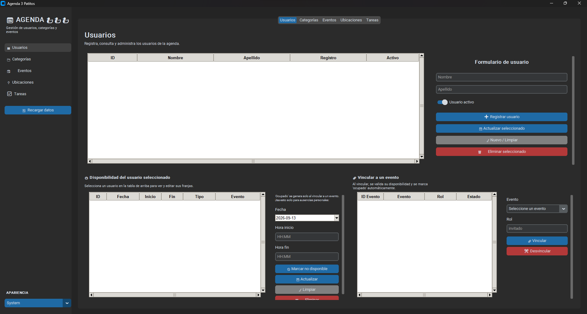
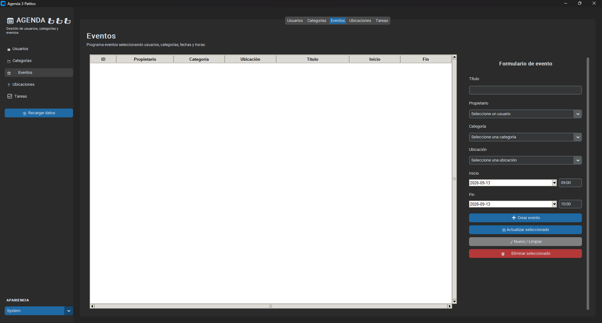
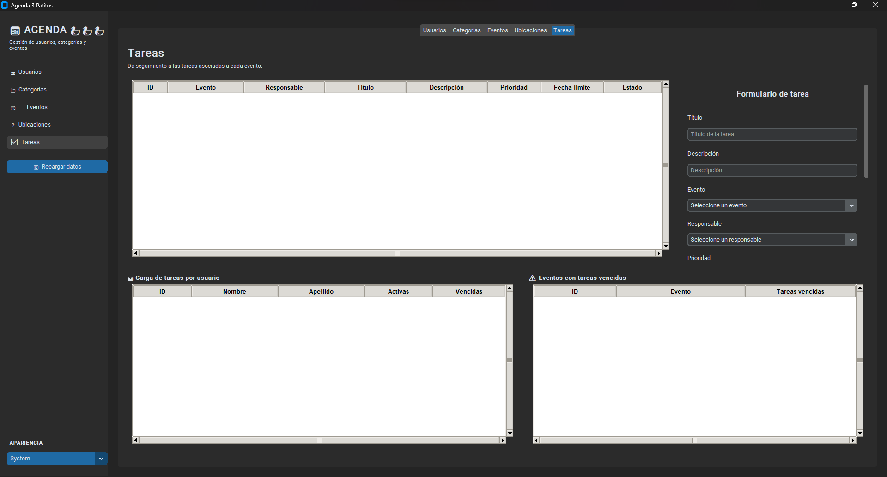
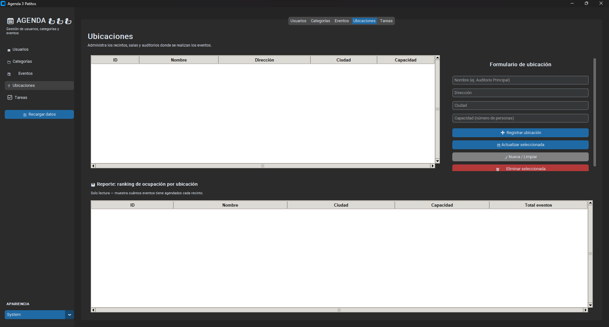
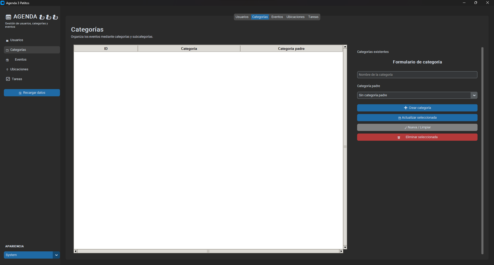

# Proyecto_agenda
Repositorio del cual se va a evaluar el primer protyecto de BD durante el II Sem del 2026.

## Requisitos e Instalación

### Prerrequisitos

- **PostgreSQL 18** (o superior), instalado localmente o corriendo en un contenedor Docker.
- **Python 3.10** (o superior).
- **Git**, para clonar el repositorio.
- Un cliente de base de datos (recomendado: [DBeaver](https://dbeaver.io/download/), aunque también sirve `psql` desde la terminal).

### 1. Clonar el repositorio

```bash
git clone https://github.com/Ju4nj0s3MM/Proyecto_agenda.git
cd Proyecto_agenda
```

### 2. Crear la base de datos en PostgreSQL

Desde tu cliente de base de datos (o `psql`), crea una base de datos llamada `agenda`:

```sql
CREATE DATABASE agenda;
```

### 3. Ejecutar el script de creación de tablas

Abre `script.sql` en tu cliente conectado a la base de datos `agenda` y ejecútalo completo. Esto crea el esquema `prototipo`, todas las tablas, vistas y triggers.

### 4. Instalar las dependencias de Python

Se recomienda usar un entorno virtual (opcional pero buena práctica):

```bash
python -m venv venv
# Windows
venv\Scripts\activate
# macOS / Linux
source venv/bin/activate
```

Instala las librerías necesarias:

```bash
pip install customtkinter psycopg2-binary tkcalendar
```

**Notas:**
- `tkinter` viene incluido con la instalación estándar de Python en Windows y macOS. En Linux (Ubuntu/Debian) puede requerir instalarse aparte:
```bash
  sudo apt install python3-tk
```
- Se usa `psycopg2-binary` en lugar de `psycopg2` para evitar la necesidad de compiladores C en la máquina (más simple de instalar en un entorno nuevo).
- `tkcalendar` es opcional: si no se instala, la aplicación sigue funcionando pero sin el selector visual de fechas (se usa un campo de texto simple como respaldo).

### 5. Configurar la conexión a la base de datos

Abre `agenda.py` y ajusta los parámetros de conexión según tu configuración local:

```python
self.conn_params = {
    "dbname": "agenda",
    "user": "postgres",
    "password": "postgres",
    "host": "localhost",
    "port": "5432",
}
```

### 6. Ejecutar la aplicación

```bash
python agenda.py
```

Si los parámetros de conexión son correctos, se abrirá la interfaz gráfica con las 5 pestañas: Usuarios, Categorías, Eventos, Ubicaciones y Tareas.

## Matriz de Trazabilidad y Estado de Implementación

### Módulo de Gestión de Ubicaciones

| Req. | Fase | Tarea | Estado |
|---|---|---|---|
| RF-08 | 1. Modelo Conceptual | Definir la entidad UBICACIONES y sus atributos obligatorios (id_ubicacion, nombre, dirección, ciudad, capacidad). | Completado |
| | 2. Modelo Lógico | Estructurar la tabla relacional especificando tipos de datos y clave primaria. | Completado |
| | 3. Modelo Físico | Codificar el `CREATE TABLE ubicaciones` en PostgreSQL con restricciones `NOT NULL` y `CHECK (capacidad > 0)`. | Completado |
| | 4. Interfaz Gráfica | Desarrollar la pestaña de Ubicaciones con tabla y formulario para registrar, consultar, actualizar y eliminar recintos. | Completado |
| RF-09 | 1. Modelo Conceptual | Establecer la relación "SE REALIZA EN" entre EVENTOS y UBICACIONES (cardinalidad N:1). | Completado |
| | 2. Modelo Lógico | Incorporar `id_ubicacion` como FK obligatoria en el esquema relacional de eventos. | Completado |
| | 3. Modelo Físico | Agregar `id_ubicacion` como columna `NOT NULL` con `REFERENCES` en `eventos`, y crear el trigger `trg_evitar_traslape_ubicacion` para prevenir eventos simultáneos en la misma ubicación. | Completado |
| | 4. Interfaz Gráfica | Integrar el selector de ubicación en el formulario de eventos, mostrar la columna Ubicación en la tabla, y capturar el error del trigger con un mensaje amigable. | Completado |
| RF-10 | 3. Modelo Físico | Diseñar la vista `vista_ranking_ubicaciones` con conteo de eventos por ubicación (`LEFT JOIN` para incluir también las subutilizadas). | Completado |
| | 4. Interfaz Gráfica | Implementar el panel de reporte de solo lectura en la pestaña de Ubicaciones mostrando el ranking de ocupación. | Completado |

### Módulo de Tareas Asociadas a Eventos

| Req. | Fase | Tarea | Estado |
|---|---|---|---|
| RF-15 | 1. Modelo Conceptual | Definir la entidad TAREAS vinculada a EVENTOS ("GENERA") y a USUARIOS ("RESPONSABLE"), con atributos título, descripción, prioridad, fecha límite y estado. | Completado |
| | 2. Modelo Lógico | Establecer las FK `id_evento` e `id_usuario_responsable` en el esquema relacional de tareas. | Completado |
| | 3. Modelo Físico | Crear la tabla `tareas` con `CHECK` para prioridad/estado y `ON DELETE CASCADE` hacia eventos. | Completado |
| | 4. Interfaz Gráfica | Desarrollar la pestaña de Tareas con CRUD completo (crear, leer, actualizar estado y eliminar). | Completado |
| RF-16 | 3. Modelo Físico | Desarrollar las vistas `vista_carga_tareas_usuario` y `vista_eventos_con_tareas_vencidas` para medir tareas pendientes por usuario y detectar eventos con tareas vencidas. | Completado |
| | 4. Interfaz Gráfica | Configurar el despliegue de ambos reportes en paneles dentro de la pestaña de Tareas. | Completado |
| RF-17 | 3. Modelo Físico | Incluir en `vista_carga_tareas_usuario` el conteo de tareas activas y vencidas, filtradas por estado y fecha límite. | Completado |
| | 4. Interfaz Gráfica | Integrar el panel "Carga de tareas por usuario" para la detección temprana de sobrecargas de trabajo. | Completado |

### Módulo de Disponibilidad de Usuarios y Gestión de Tiempos

| Req. | Fase | Tarea | Estado |
|---|---|---|---|
| RF-11 | 1. Modelo Conceptual | Definir la entidad DISPONIBILIDADES vinculada a USUARIOS ("TIENE") y el catálogo TIPOS_DISPONIBILIDAD ("ES_DE_TIPO"). | Completado |
| | 2. Modelo Lógico | Estructurar las tablas relacionales de disponibilidad y sus FK hacia usuarios y tipos_disponibilidad. | Completado |
| | 3. Modelo Físico | Crear las tablas `tipos_disponibilidad` (con datos semilla: disponible, ocupado, no disponible) y `disponibilidades` con `CHECK` de horas válidas. | Completado |
| | 4. Interfaz Gráfica | Desarrollar el panel de disponibilidad dentro de la pestaña Usuarios, con entrada manual solo para "no disponible" (ausencias personales) y visualización de las franjas del usuario seleccionado. | Completado |
| RF-12 | 3. Modelo Físico | Implementar 4 triggers para automatizar y validar la disponibilidad: bloqueo de vinculaciones/eventos en conflicto (`trg_evitar_conflicto_disponibilidad`, `trg_verificar_disponibilidad_propietario`) y generación/liberación automática de "ocupado" (`trg_marcar_ocupado_por_participacion`, `trg_sincronizar_disponibilidad_propietario`, y sus triggers de liberación al desvincular/eliminar). | Completado |
| | 4. Interfaz Gráfica | Integrar el panel "Vincular a un evento" para asociar usuarios a eventos, mostrando el bloqueo automático de conflictos y liberando la disponibilidad al desvincular. | Completado |

## Evidencias de la Interfaz Gráfica

### Pestaña: Usuarios (con Disponibilidad y Vinculación a Eventos)


La pantalla de Gestión de Usuarios administra el directorio de personas registradas, y desde aquí se gestionan los módulos de Tareas y Disponibilidad de ese usuario:
- **Tabla Central**: lista de usuarios con ID, Nombre, Apellido, Fecha de Registro y Estado Activo.
- **Formulario CRUD**: campos de Nombre y Apellido, switch de estado activo, y botones para Registrar, Actualizar, Limpiar y Eliminar.
- **Panel "Disponibilidad del usuario seleccionado"**: muestra las franjas de tiempo del usuario elegido en la tabla (columna Evento indica si la franja "ocupado" fue generada automáticamente por un evento vinculado, o "—" si es una ausencia manual). Incluye un formulario para marcar manualmente franjas "no disponible" (ej. vacaciones).
- **Panel "Vincular a un evento"**: permite asociar al usuario seleccionado con un evento existente (tabla `participaciones`), validando automáticamente su disponibilidad — si hay conflicto de horario, el sistema bloquea la vinculación con un mensaje explicativo.

### Pestaña: Categorías


La pantalla de Gestión de Categorías organiza las actividades mediante una estructura jerárquica de categorías y subcategorías.
- **Tabla Central**: lista las categorías con su categoría padre (o "Sin categoría padre" si es raíz).
- **Formulario CRUD**: campo de nombre y un dropdown para seleccionar la categoría padre, con protección a nivel de base de datos (trigger `trg_evitar_ciclo`) contra ciclos en la jerarquía.

### Pestaña: Eventos


La pantalla de Gestión de Eventos programa actividades vinculándolas con usuario propietario, categoría y ubicación.
- **Tabla Central**: ID, Propietario, Categoría, Ubicación, Título, Inicio y Fin.
- **Formulario CRUD**: selectores dinámicos de Propietario, Categoría y Ubicación (poblados desde sus respectivas tablas), selectores de fecha/hora de inicio y fin.
- **Validaciones automáticas a nivel de base de datos**: el sistema bloquea el guardado si la ubicación ya tiene otro evento en ese horario (RF-09), o si el propietario tiene una franja "ocupado"/"no disponible" que se cruza (RF-12) — ambos casos muestran un mensaje de error amigable en lugar del error técnico de PostgreSQL.

### Pestaña: Ubicaciones


La pantalla de Gestión de Ubicaciones administra los recintos físicos donde se realizan los eventos (RF-08).
- **Tabla Central**: ID, Nombre, Dirección, Ciudad y Capacidad.
- **Formulario CRUD**: campos de texto para nombre, dirección, ciudad y capacidad (validada como número entero positivo).
- **Panel de reporte "Ranking de ocupación por ubicación"**: vista de solo lectura conectada a `vista_ranking_ubicaciones`, que muestra cuántos eventos tiene agendados cada recinto — permite identificar ubicaciones subutilizadas (RF-10).

### Pestaña: Tareas


La pantalla de Gestión de Tareas da seguimiento a las actividades asociadas a cada evento (RF-15).
- **Tabla Central**: ID, Evento, Responsable, Título, Descripción, Prioridad, Fecha límite y Estado.
- **Formulario CRUD**: selectores dinámicos de Evento y Responsable, combos de Prioridad y Estado (con valores controlados por `CHECK` en la base de datos), selector de fecha límite.
- **Panel "Carga de tareas por usuario"**: vista de solo lectura conectada a `vista_carga_tareas_usuario`, mostrando tareas activas y vencidas por persona (RF-17).
- **Panel "Eventos con tareas vencidas"**: vista de solo lectura conectada a `vista_eventos_con_tareas_vencidas`, identificando qué eventos arrastran
